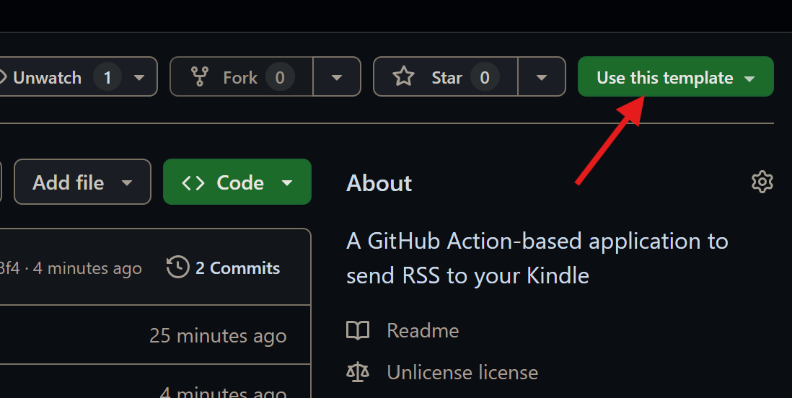

# KINGSRSS

> Everything is RSSible.  
*from [RSSHub Homepage](https://docs.rsshub.app)*

So should it be on your Kindle.

KingsRSS is a GitHub Action-based application that automatically sends RSS feed updates to your Kindle. It has many advantages over other services.

- Free & open-source: KingsRSS uses the Unlicense, which means you can use it freely.
- Low-cost: KingsRSS depends on GitHub Action and email services, which can be both free.
- Without limits: KingsRSS doesn't have a feed number or source limit.
- Community support: KingsRSS is on GitHub; hundreds and I are ready to help you!

## 1. Deployment

The deployment of KingsRSS is easy. Follow these steps.

### 1.1 Create a repository based upon this one

KingsRSS is a personal service which *should* be deployed on your own account. This repository is not a public instance; any workflow runs are disabled. So let's first create your KingsRSS.

Click "Use this template" in the up-right corner and choose "Create a new repository".



Now you can specify some settings about the new repository. The name and description are on your own, but it's **strongly** recommended to make it private, since your email password may be stored in explicit text.

Remember to go to Settings -> Actions -> General to enable "Read and write permissions" for the workflow.

### 1.2 Basic and required configuration

First you can try to use github.dev editor, which is similar to VS Code and easier to edit configuration files. Just modify the address from github.com to github.dev.

Next, please open the file src.conf. Here's you feeds. You should put RSS feeds line by line in the file, for example:

```
https://rss.website/somerss
https://another.rss/somerss/files
```

Please note the dependency we use to generate html files is **not** fail-proof, so make sure they are all valid adresses.

Then refer to /.github/workflows/push_updates.yml. It's where you can modify configurations.

- On line 4: `- cron: '0 10 * * *'` is a POSIX crontab time. Refer to [POSIX standards](https://pubs.opengroup.org/onlinepubs/9699919799/utilities/crontab.html) to see how to change it.
- On line 45, 46, 48 and 49, you can change it into your own email provider. The original repository assumes you are using an Outlook account. Please use a big company's service so SMTP is supported, e.g. Outlook and Gmail.

> Note: **WARNING!** By using methods mentioned above, your password is **EXPLICITLY** stored in you repository. Please use [this method](https://github.com/marketplace/actions/send-email) to enable environment variable to avoid this problem.

### 1.3 Advanced and optional configuration

[TODO]: FILL THIS AREA!

## 2. Acknowledgements

[TODO]: FILL THIS AREA!
