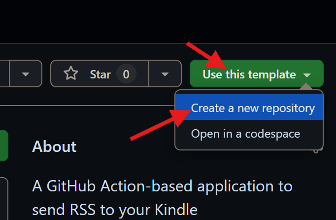
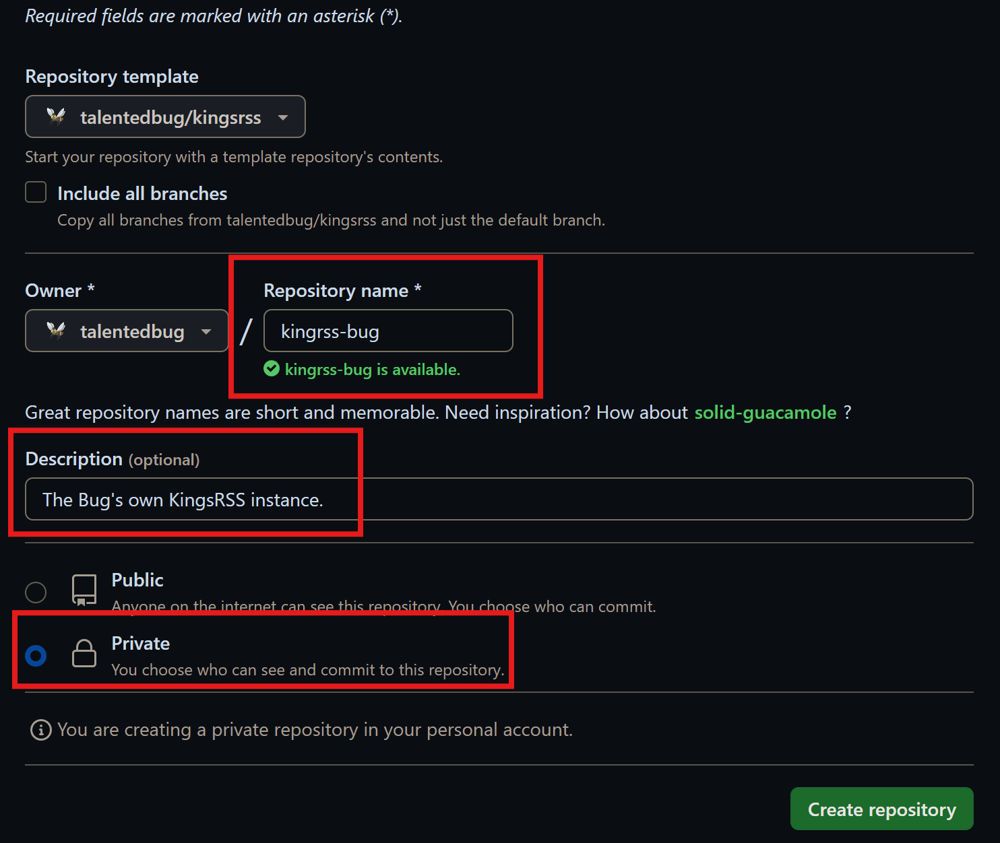
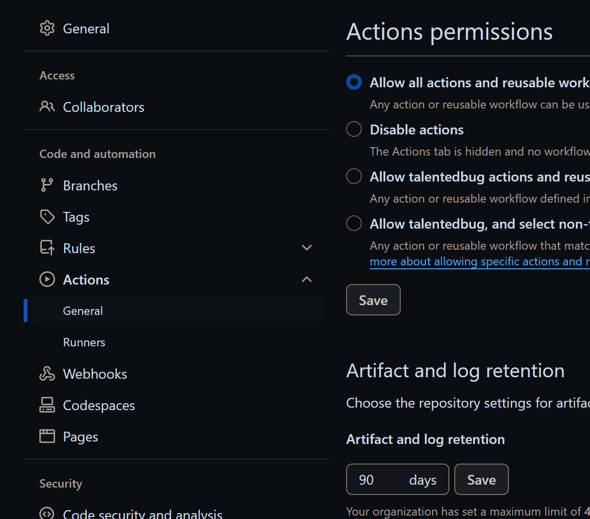
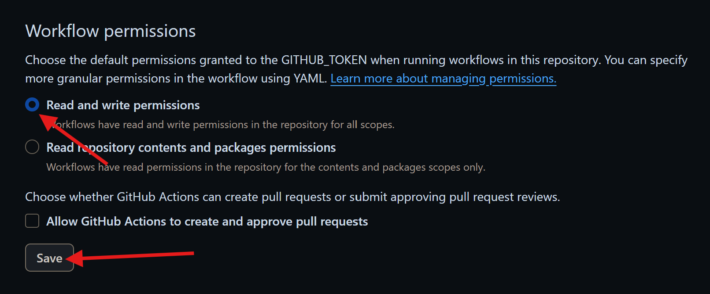
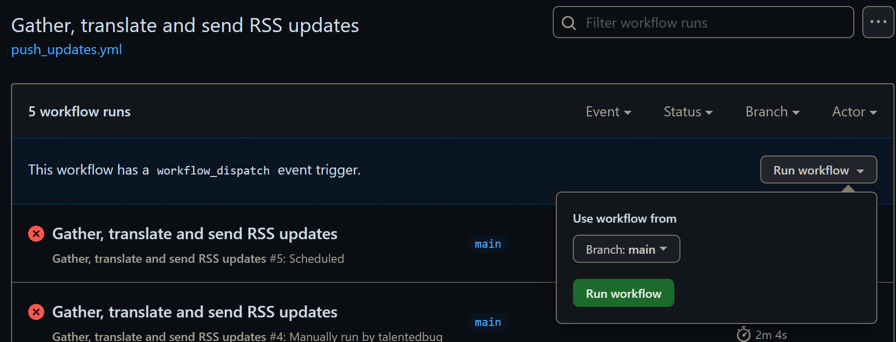

# KingsRSS

> **Attention**: KingsRSS is now **DEPRECIATED**.
> Due to questions around KingsRSS's dependencies, rss-to-html and html-to-epub, are not actively maintained and not customizable enough, KingsRSS has been depreciated and archived. A better solution to privately send RSS to Kindle is to use [Calibre News Delivery](https://github.com/bookfere/Calibre-News-Delivery) by Bookfere, which is more stable and customizable. If you insist using KingsRSS, any problems are on your own risk.

> Everything is RSSible.  
*From [RSSHub Homepage](https://docs.rsshub.app)*

So should it be on your Kindle.

KingsRSS is a GitHub Action-based application that sends RSS feed updates to your Kindle on schedule. It has the following advantages over other services:

- *Completely* free and open-source. Using neither the application nor the code is limited.
- Customizable. The configuration is based upon GitHub Action, which means you can change anything in all the progress.
- Low-cost. GitHub Action is free to use in a public repository; even if you use a private repository, 3,000 minutes per month is enough.
- User-friendly. Even if you are new to GitHub, you can make it usable following the instructions.
- Many, many more...

The README.md file will show you around KingsRSS and tell you how to set up one for yourself. Let's go!

## 1. Setting up KingsRSS

> Warning: In the following steps, you may have to store your email password in **explicit** forms. So creating a private repository is generally recommended.

### 1.1 Create a repository based on this one

If you are not reading these instructions from the homepage of the repository, please go [there](https://github.com/talentedbug/kingsrss).

Now you can see a green "Use this template" button on the top-right corner. Click it and choose "Create a new repository".



Now, you are directed to a page asking you to fill information about the new repository.

- "Repository name": It depends on you. Any name is okay.
- "Description": Write something about your KingsRSS.
- "Private": Choose this if you **don't** know what you are doing.
- Others can be left unchanged safely.



Click "Create repository" at the bottom of the page.

Then you will be brought to the main page of the repository. You can check again that your repository is private by looking for a lock beside your the name of your repository.

### 1.2 Do basic settings

To make it work, some simple settings are necessary. Now don't be afraid of configuration and let's set off!

First refer to Settings in the tab bar, and uncheck "Issues" and "Projects" which is not used by KingsRSS. Then go to Actions -> General in the sidebar.



Find "Workflow permissions" and choose "Read and write permissions" option, so that KingsRSS (which uses Action to reach files) can edit your repository. Don't forget to click "Save" just behind it.



Then return to "Code" tab.

Please look through the files in KingsRSS. The most important files you should know are `src.conf` and `.github/workflows/push_updates.yml`. We will use them for customization.

First let's go into `src.conf`. You can see an example of BBC World News feed provided by RSSHub. To add more feeds, just paste URLs line by line in this file. Comments are not allowed.

```
https://rsshub.app/bbc/world
https://otherwebsite.com/otherfeeds/withorwithout.xml
```

Then the most important thing comes: `.github/workflows/push_updates.yml`. Now let's go into next section.

### 1.3 Workflow settings

On line 4 `- cron: '0 10 * * *'`: This is a strange POSIX crontab format. Please read [the standard](https://pubs.opengroup.org/onlinepubs/7908799/xcu/crontab.html) and set it to what you need.

On line 81 to 84 and 86:

```yaml
server_address: youremailproviders.smtp.address
server_port: portnumber
username: youremail@yourprovier.com
password: yourpassword
...
to: yourkindleemail@kindle.com
```
Here's where you should set your email information. Most big-brand email providers like Outlook and Gmail have free 3rd-party SMTP service. Here's an example of Outlook, and if you use Gmail more often, please refer to [davidd66/action-send-email](https://github.com/dawidd6/action-send-mail) for an example.

```yaml
server_address: smtp-mail.outlook.com
server_port: 587
username: youremail@outlook.com # Set this to your Outlook account
password: yourpassword # So do your password
                       # Warning: Your password is stored *explicitly*!!!
...
to: yourkindleemail@kindle.com # Set this to your Send to Kindle email
                               # See it in your device settings
```

And don't forget to add the email in use to your Send to Kindle allow list. You can search for information on how to do so everywhere.

Now, if you are a newbie about yaml and GitHub Action, that's all needed. If you need a detailed explanation and advanced settings, read the section below.

### 1.4 Advanced settings

KingsRSS runs on GitHub Action. So everything you can do in Action can be done to KingsRSS. Some basic hacks about KingsRSS are the following.

> KingsRSS is very simple and lack of functions. Please contribute to the initial repository if you have nice ideas.

On line 14 you can see `rm record.db -f`. This is because the dependency of KingsRSS, rss-to-html, will create a database of which updates has been downloaded before. This may cause problems if you manually trigger the workflow, since updates that have been downloaded today will be skipped.

On some places you can the these commands:

```
--verbose
```

```
echo "Current files in ./:"
ls
```

These lines are used for debugging, since every log will be displayed. If you are annoyed by the long outputs, you can safe delete these lines.

On line 57 you can see an argument passed to html-to-epub that decides the cover of your epub file. This file is located in the root directory of the repository. You can edit it to any pictures you like and then change the corresponding file name.

On the following lines are author and title definitions. You can change them to anything you like.

## 2. Push your first update

Go to Actions tab in the tab bar and choose "Gather, translate and send RSS updates" in the sidebar. You will see a notice like this:

```
This workflow has a workflow_dispatch event trigger.
```

Click "Run workflow" on the right and choose main branch, and then click "Run workflow".



Depending on your number of feeds, the progress may take one to a few minutes. If everything goes well, you will see a green symbol beside your name.

Now refer to [Send to Kindle](https://www.amazon.com/sendtokindle) and you will see the file being transfered. Congratulations!

If not, please check the steps below. If you are still trapped in some points, please keep all the `--verbose` and `echo...ls` lines and copy the logs of running, and then create an issue in the repository.

## 3. Acknowledgements

There's a Chinese saying that tell us not to make wheels repeated for a car. So it is in programming.

This project is built upon these brilliant yet separated projects:

- [html-to-epub](https://github.com/gonejack/html-to-epub) by gonejack
- [rss-to-html](https://github.com/gonejack/rss-to-html) by gonejeck

Depending on these two Go programs, KingsRSS generates epub files.

- [action-send-email](https://github.com/marketplace/actions/send-email) by davidd66 and others

With it KingsRSS can send emails easily.

- And GitHub Action of course

Which gives me powerful hosts to run these for free.

- [WhereMyLife](https://wheremylife.cn)

This is the project that lets me start mine. Because its limits on RSS sources, I look for an alternative choice but find none. So I start this. The author of WhereMyLife, [benn](https://www.bennhuang.com/) is generous enough to spend large amount of money on servers that provide centralized service for free with minimal limits.
